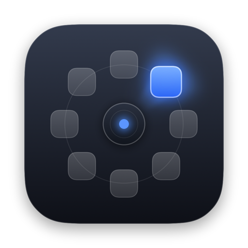
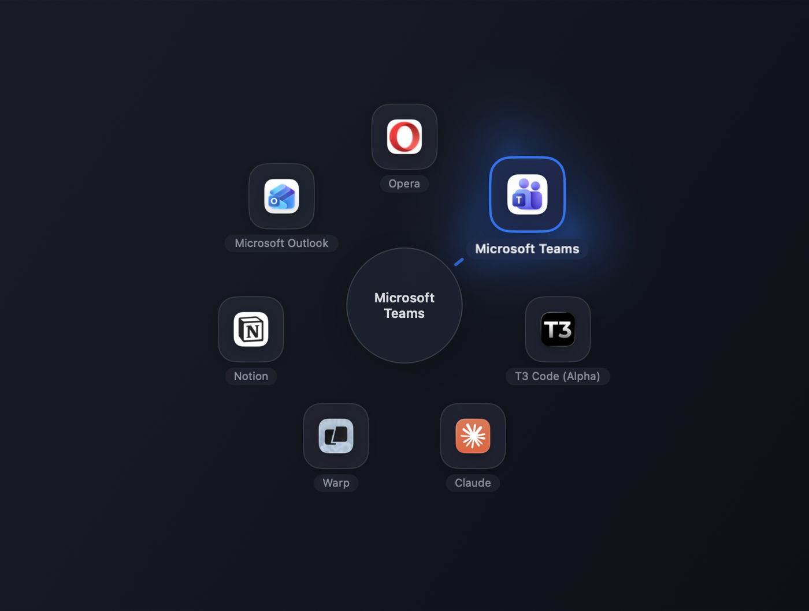

# MiddleRing

### Switch windows with a flick, not a hunt.

Middle-click anywhere and a ring of your open windows opens right at the cursor.
Flick in a direction, let go, you are there. No squinting at a strip of
thumbnails, no cycling through twelve windows to reach the one behind you.

**[⬇︎ Download for macOS](https://github.com/oguzberkacar/middlering-releases/releases/latest)**  ·  Apple Silicon · signed & notarized

 

 

## Why a ring

Every window switcher on the Mac makes you read. ⌘-Tab gives you a row of
identical icons in an order you have to think about. Mission Control scatters
everything and asks you to aim at a moving target.

A ring asks for a direction instead. Your hand already knows that Slack is
up-left and the terminal is down-right, the same way it knows where the shift
key is. After a day you stop looking at the ring at all — you flick and release,
and the right window is in front of you.

The idea is stolen wholesale from the weapon wheel in GTA, which solved this
problem for eight items and a thumbstick a long time ago.

## What it does

- **Flick and release.** Hold the middle button, move, let go. Releasing near
  the centre cancels, so a mistaken press costs nothing.
- **Or tap and browse.** A quick tap leaves the ring open. Click, press Return,
  or tap again to commit; Escape backs out.
- **Windows, not just apps.** Choose between one slot per app, one per window,
  or a hybrid where pushing past an app fans its windows out around it.
- **Per-display.** By default the ring only offers windows on the display your
  cursor is on, which is usually the only set you meant.
- **Live previews.** Optional. Off by default, because the icon-only ring opens
  faster and needs no Screen Recording permission.
- **Your trigger.** Middle button, middle button with a modifier, or a keyboard
  shortcut. Per-app exclusions for anywhere you want middle-click left alone.

## Requirements

macOS 14 or later. MiddleRing needs Accessibility permission — it is what lets
the app see the window list and bring a window forward. Screen Recording is only
requested if you turn live previews on.

## Install

Download the DMG, drag MiddleRing to Applications, open it, and grant
Accessibility when asked. The app lives in the menu bar; there is no Dock icon.

## Source

The source is private. This repository carries the releases and the issue
tracker — bug reports and feature requests are welcome here.
